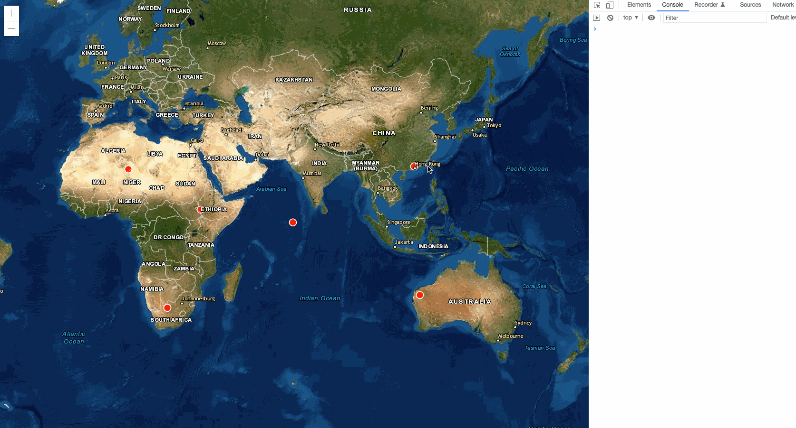

# arcgis-map-event


[![blog](https://img.shields.io/badge/blog-yesifang.com-orange?logo=data:image/png;base64,iVBORw0KGgoAAAANSUhEUgAAACAAAAAgCAMAAABEpIrGAAAABGdBTUEAALGPC/xhBQAAACBjSFJNAAB6JgAAgIQAAPoAAACA6AAAdTAAAOpgAAA6mAAAF3CculE8AAABjFBMVEUAAAAIAQUiBhQVBA05CyK0I2z4MJTgKoV8GEoKAgZyFkT8MZfTKX4dBRFWEDP9MZfMJ3kGAQQHAQTlK4htFUEAHRMATDAAbUQAf1EAh1QAgFAAbUUATDAAHhNMDy7KJngAeUsAKBp9GEr4MJMDAQIAmWEAWzkABAOGGlD9MZYAcUgABQNoFD7mLIoAZUCdHl4ANiKiH2EpCBgAh1UAAgERAwrVKH9nFD0ALBwSAwuqIWXmK4pTEDIAWTgrCBp2F0eVHVmKG1NWETMAdEgAgVAAAQIAJTcATXIAZJQAbqUAap0AVoEAfE4AAQEAN1EAgMAAaEIACQ4Aap4ARiwACQ0AebMAmV8AEwwAAAAAZ5oAZT8AMkkAkFoAEQsAebMAl14AGCQAkl0ALx4AOlYAeEsAGRAATHAAbkUAll0All4AbkYAMB4ATXMABwQAIxYANiIAPicANyIAJBYAQF4AIjIAis0AAgMAhsYAZJYARWYAk9oAHy4ABQcAfbkAO1gAis3/MZgAmmEAld3///8EabibAAAAgHRSTlMACCIVObX54XwKcv3UHVb+zQYH5m0xfrTU4NW1fzJMy8hDffkD/pcHh/69CGjnqJ5ZoynfBBHWZ0kSqudTlCt2lotWwNUCQIOrvrWVzwFe3a4QtnQPz/0gAbKnVe4c0Psp9E9jximBtvj4t0+FCzpaZlo7bTruA+Wtdfs1CNdm7ZpKyEIAAAABYktHRIP8tM/SAAAAB3RJTUUH5QoVBh0NInrzjgAAATtJREFUOMt902VbwzAUBeDLcAYMhru7uzPcXYcP1+EyPMkvZ03TNk0TztfzNnL7BECeCFck/JOo6BiEYuPiVX2CG9EkJsn7ZA9iSUmV9d40ZCYdICMzKzsnNy+/wASFVo+KALCR4hIGSjlQVm4BXFFZRUE1B2q8HMC4tk4D9RxoABvAjRpwuS3QJADcrIkW6witImhrD4OOTtZ7ukAEuFtboqeXjqqvH5xgQL/qoG9oeET/FQIYdQxWAGNmMT4xOTU9MyuCOVbPLywSGhEs6f3yCiFysEr7tXWiABubWu/fIiqwTRfYISqwu0fBvgoc0DlCgCjA4ZF+hWMFODllMzizgfML2l5eXfuNGd7YAARv7+4fHoPc9J/swJlnrn+Rgdc3C4SkT+vd7D8+peDr2+h/FK838Ev3D4W//wNiKCWwWalJAwAAACV0RVh0ZGF0ZTpjcmVhdGUAMjAyMS0xMC0yMVQwNjoyOToxMyswMDowMP1Zb/cAAAAldEVYdGRhdGU6bW9kaWZ5ADIwMjEtMTAtMjFUMDY6Mjk6MTMrMDA6MDCMBNdLAAAAAElFTkSuQmCC)](//yesifang.com)

> arcgis 地图事件工具包，提供更方便的事件处理接口。
> Arcgis Map event Kit, which provides a more convenient event handling interface.

<div align="center">
  <a href="https://nodei.co/npm/arcgis-map-event/"></a>
</div>

[中文文档](./docs/zh_cn.md)

## Run Simple Demo



```shell
$ git clone https://github.com/SuperYesifang/arcgis-map-event.git
$ cd arcgis-map-event
$ npm install
$ npm run dev
```


## Usage

`new MapEvent(options)`

1. Use CDN

```html
<script src="https://raw.githubusercontent.com/SuperYesifang/arcgis-map-event/master/dist/arcgis-map-event.cdn.js"></script>
````

2. Use ESM

```js
import MapEvent from "arcgis-map-event";

let mapEvent = new MapEvent();
```


## Options

| option | type | description |
| -- | -- | -- |
| `view` | `MapView` | map view |
| `cursor`? | `string` | normal cursor style. default value: `options.view.cursor` \|\| `"default"` |
| `hoverCursor`? | `string` | global graphic hover cursor style. default value: `"pointer"` |
| `objectIdField` | name of unique objectId field. default `objectId` |


## Properties

Instance Properties

| property | description |
| -- | -- |
| `view` | map view instance. |
| `cursor` | normal cursor style. default value:  `instance.view.cursor` \|\| `"default"` |
| `hoverCursor` | global graphic hover cursor style. default value: `"pointer"` |
| `hoverList` | hover list. |
| `onHoverList` | hover event listener list. |
| `onClickList` | click event listener list. |


### view

`instance.view:ArcgisView`

using [ArcgisView](https://developers.arcgis.com/javascript/latest/api-reference/esri-views-View.html) instance of MapEvent instance.

```js
let mapView = new MapView(options); // Arcgis MapView
let mapEvent = new MapEvent({
    view: mapView
});

console.log(mapEvent.view === mapView); // true
```


### cursor

`instance.cursor:string`

normal mouse cursor style. default value: `instance.view.cursor` || `"default"`.


### hoverCursor

`instance.hoverCursor:string`

global mosue hover style when hovering graphic. default value:  `"pointer"`.


### hoverList

`instance.hoverList:Map`

A list of graphic(s) hover data. This is a JavaScript's Map instance.

```js
let mapEvent = new MapEvent(options);

mapEvent.hover(graphic, hoverSymbol, opts);
let hoverList = mapEvent.hoverList.get(graphic);
console.log(hoverList[0].oSymbol === graphic.symbol); // true
console.log(hoverList[0].symbol === hoverSymbol); // true
console.log(hoverList[0].options === opts); // true
console.log(hoverList[0].hover); // this graphic current hover status. (boolean)
```


### onHoverList

`instance.onHoverList:Map`

A list of graphic(s) hover event listeners. This is a JavaScript Map instance.

```js
let mapEvent = new MapEvent(options);

mapEvent.onHover(graphic, listener1);
mapEvent.on("hover", graphic, listener2);
let listeners = mapEvent.onHoverList.get(graphic);
console.log(listeners[0] === listener1); // true
console.log(listeners[1] === listener2); // true
```


### onClickList

`instance.onClickList:Map`

A list of graphic(s) click event listeners. This is a JavaScript Map instance.

```js
let mapEvent = new MapEvent(options);

mapEvent.onClick(graphic, listener1);
mapEvent.on("click", graphic, listener2);
let listeners = mapEvent.onClickList.get(graphic);
console.log(listeners[0] === listener1); // true
console.log(listeners[1] === listener2); // true
```


## Methods

Instance Methods

| method | description |
| -- | -- |
| [on](#on) | add map event listener. |
| [off](#off) | remove map event listener. |
| [reset](#reset) | reset hover or event(s) listener list. |
| [hover](#hover) | add hover changes to graphic. |
| [onHover](#onHover) | add hover event listener. |
| [onClick](#onClick) | add click event listener. |


### on()

`instance.on(event, graphic | graphic[], listener:(context)=>{}):remove | remove[]`
Instance's method. Register a event listener to graphic(s).

+ event: [supports events](#events).
+ graphic: arcgis's Graphic Instance(s).
+ [listener](#listener): a callback funciton when event happen.(event listener).
+ return: execution return results.
  + remove: current event listener's remove methods(s).

```js
let mapEvent = new MapEvent(options);
let remove = mapEvent.on("click", graphic, funciton (context) {
	// ...do something
});
remove(); // remove graphic's event listener.
let removes = mapEvent.on("click", [graphic1, graphic2], funciton(context) {
	// ...do something
});
removes[0](); // remove graphic1's event listener.
removes[1](); // remove graphic2's event listener.
```


### off()

`instance.off(event, graphic | graphic[], listener | true)`
Instance's method. Remove event listener from graphic(s).

+ event: [supports events](#events)
+ graphic: arcgis's Graphic Instance(s).
+ [listener](#listener): a event listener need to be deleted (must be registered on the graphic)
	+ `true`: will remove all event listener from graphic(s).

```js
let mapEvent = new MapEvent(options);
mapEvent.on("click", [graphic1, graphic2], listener_m);
mapEvent.on("click", graphic1, listener_1);
	
mapEvent.off("click", graphic2, listener_m); // remove graphic2's listener_m event listener
mapEvent.off("click", graphic1, true); // remove graphic1's all event listeners
```


### reset()

`instance.reset(list | list[])`
Instance's method. Reset all hover data list or event(s) listener list. Equivalent to remove all graphics's all hover data or all event listener.

+ list: hover data list or event(s) listener list. default value: `[ "hover", "onHover", "onClick" ]`

list prossible values: 

+ `"hover"`: match `instance.hoverList`
+ `"onHover"`: match `instance.onHoverList`
+ `"onClick"`: match `instance.onClickList`

```js
let mapEvent = new MapEvent(options);
mapEvent("click", [graphic1, graphic2], listener);
mapEvent("click", graphic3, listener3);
mapEvent("hover", graphic, listener);
mapEvent.reset("click"); // reset all graphic's click event listener
```


### hover()

`instance.hover(graphic | graphic[], symbol, options)`
Instance's method. Setting graphic(s) on mouse hover's symbol style.

+ graphic: arcigs's Graphic Instance(s).
+ symbol: graphics(s)'s symbol style when mouse hovering it(s). (support [autocast](https://developers.arcgis.com/javascript/latest/programming-patterns/#autocasting))
+ options: more options
	+ hoverCursor: cursor style when mouse hovering graphic(s). (this options will cover constructor global hoverCursor)

```js
let mapEvent = new MapEvent(options);
mapEvent.hover(graphic, {
	type: "simple-marker",
	style: "circle",
	color: "red",
	size: "10px"
}, { hoverCursor: "not-allowed" });
```


### onHover()

`instance.onHover(graphic | graphic[], listener):remove`
Instance's method. Add a `"hover"` event listener to graphic(s).

+ graphic: arcgis Graphic Instance(s).
+ [listener](#listener): a callback funciton when `"hover"` event happen.(event listener)
+ return: execution return results.
	+ remove: event listener remove funciton(s).

```js
let mapEvent = new MapEvent(options);

let remove = mapEvent.onHover(graphic, listener_x); // equals mapEvent.on("hover", graphic, listener_x)
remove(); // remove graphic's 'hover' event listener listener_x.
let removes = mapEvent.onHover([graphic1, graphic2], listener_m);
removes[0](); // remove graphic1's 'hover' event listener listener_m.
removes[1](); // remove graphic2's 'hover' event listener listener_m.
```


### onClick()

`instance.onClick(graphic | graphic[], listener):remove`
Instance's method. Add a `"click"` event listener to graphic(s).

+ graphic: arcgis Graphic Instance(s).
+ [listener](#listener): a callback funciton when `"click"` event happen.(event listener)
+ return: execution return results.
	+ remove: event listener remove funciton(s).

```js
let mapEvent = new MapEvent(options);

let remove = mapEvent.onClick(graphic, listener_x); // equals mapEvent.on("click", graphic, listener_x)
remove(); // remove graphic's 'click' event listener listener_x.
let removes = mapEvent.onClick([graphic1, graphic2], listener_m);
removes[0](); // remove graphic1's 'click' event listener listener_m.
removes[1](); // remove graphic2's 'click' event listener listener_m.
```


## events

supports events list.

| event | description |
| -- | -- |
| `"hover"` | when mouse hover graphic happen. |
| `"click"` | when mouse click graphic happen. |

```ts
type events = "hover" | "click";
```


## listener

`listener:Listener`

MapEvent event listener. (It's actually an callback function)

```ts
interface Remove {
    ():boolean | boolean[];
}
type events = "hover" | "click";
type context = {
    type:evets; // event type
    $event:ArcgisEventHandle; // view original event object.
    graphc:Graphic; // graphic of triggering this event.
    point:Point; // point of the mouse location. (This is a Arcgis Point instance)
    remove:Remove; // remove this listener's function.
}
interface Listner {
    (context:context):void;
}
let listener:Listener = function (context) {
    // ...do something
}
```

## Other Issues

+ Q：Feature Graphis cannot trigger events？
+ A：You can add a unique `objectId` attribute to graph `attributes`.Setting unique objectId is used to help find graphics.
    ```js
    new Graphic({
        geometry,
        attributes: {
            objectId: "unique id"
        }
    });
    ```

Relevant：

+ [ArcgisEventHandle](https://developers.arcgis.com/javascript/latest/api-reference/esri-views-MapView.html#events-summary)
+ [Graphic](https://developers.arcgis.com/javascript/latest/api-reference/esri-Graphic.html)
+ [Point](https://developers.arcgis.com/javascript/latest/api-reference/esri-geometry-Point.html)
